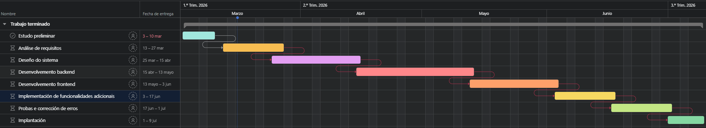

# Anteproxecto

- [Anteproxecto](#anteproxecto)
  - [1- Idea do proxecto](#1--idea-do-proxecto)
  - [2- Contextualización](#2--contextualización)
  - [3- Estudio de alternativas e viabilidade](#3--estudio-de-alternativas-e-viabilidade)
    - [3.1- Estudio de alternativas](#31--estudio-de-alternativas)
    - [3.2 Xustificación da alternativa](#32-xustificación-da-alternativa)
  - [4- Requirimentos técnicos](#4--requirimentos-técnicos)
  - [5- Planificación](#5--planificación)

---

# 1- Idea do proxecto

O proxecto consiste no desenvolvemento dunha plataforma web enfocada ao **powerlifting e ao adestramento de forza**, na que distintos adestradores poderán ofrecer os seus servizos ós usuarios interesados nesta modalidade deportiva, tanto principiantes que desexen iniciarse nesta disciplina, coma usuarios máis avanzados que queiran formarse con expertos na materia.

A aplicación contará con distintos tipos de perfís:

- **Perfil de adestrador:** poderá ter o seu perfil profesional, no que publicar rutinas de adestramento, contidos e cursos formativos ou dar consellos relacionados co powerlifting. Ademais terá un apartado de merchandising, no que poderá vender produtos da súa propia marca, como roupa, accesorios ou material deportivo.

- **Perfil de cliente:** os usuarios poderán acceder aos contidos publicados polos distintos adestradores, seguir as súas rutinas, rexistrar o progreso diario dos seus adestramentos, calcular os seus RM (máximo peso que se pode levantar a unha repetición nun exercicio en concreto), comprar produtos da tenda e contactar co adestrador en caso de dúbidas.

- **Perfil administrador:** será o encargado de supervisar o funcionamento da plataforma, xestionar usuarios, contidos e posibles incidencias.

O obxectivo principal é crear unha ferramenta que **centralice nun mesmo lugar o adestramento, o seguimento personalizado e a relación entre adestradores e deportistas**, facilitando así o acceso a contido profesional e mellorando a organización e a experiencia do adestramento persoal.

---

# 2- Contextualización

Nos últimos anos o **powerlifting e o adestramento de forza experimentaron un gran crecemento**, especialmente grazas ás redes sociais, ca presenza de moitos influencers e comunidades deportivas en internet. Cada vez máis persoas buscan mellorar o seu rendemento físico mediante rutinas estruturadas e asesoramento profesional.

Actualmente moitos adestradores comparten os seus contidos en plataformas como redes sociais ou aplicacións de mensaxería privada, pero estas solucións presentan varias limitacións:

- Falta de organización dos contidos.
- Dificultade para realizar un seguimento do progreso do usuario.
- Ausencia de ferramentas específicas para o rexistro dos adestramentos.
- Falta de relación entre o contido formativo, rutinas e venda de produtos.

Este proxecto pretende dar resposta a estas necesidades mediante unha **plataforma web especializada**, que combine nun único lugar:

- Xestión de contidos de adestramento.
- Seguimento do progreso dos usuarios.
- Comunicación entre adestradores e clientes.
- Venda de merchandising deportivo.

Ademais, o desenvolvemento desta aplicación podería **abrir unha oportunidade de negocio**, xa que permitiría a adestradores ofrecer os seus servizos de forma profesional e monetizar o seu contido a través de subscricións, cursos ou venda de produtos.

Nun futuro, esta plataforma podería comercializarse como unha ferramenta para **adestradores persoais ou centros deportivos que queiran xestionar os seus clientes de forma dixital**.

---

# 3- Estudio de alternativas e viabilidade

## 3.1- Estudio de alternativas

Para o desenvolvemento desta plataforma web analizáronse diferentes alternativas tecnolóxicas.

### Alternativas

**A1 — Desenvolvemento con PHP + MySQL + HTML + CSS + JavaScript**  
Aplicación web desenvolvida desde cero utilizando PHP no backend e unha base de datos MySQL.

**A2 — Desenvolvemento con Node.js + Express + React + Sass + MariaDB**  
Creación dunha API REST utilizando Node.js para o backend, react para o frontend e Sass para os estilos da aplicación.

**A3 — Desenvolvemento con framework Laravel + Blade + MySQL + Bootstrap**  
Uso do framework Laravel para estruturar a aplicación seguindo o patrón MVC. A interface desenvolveríase con **Blade** a modo de plantillas, combinado con **HTML**, **CSS**, **JavaScrpt** e **Bootstrap** para o deseño visual

**A4 — Plataforma baseada en CMS (WordPress + WooCommerce)**
Creación da plataforma empregando WordPress como CMS e WooCommerce para a xestión da tenda de merchandising e contidos.

| Alternativa | Viabilidade técnica                                                                                                                                             | Viabilidade económica                                                   | Temporalidade                                                             | Valoración Global |
| ----------- | --------------------------------------------------------------------------------------------------------------------------------------------------------------- | ----------------------------------------------------------------------- | ------------------------------------------------------------------------- | ----------------- |
| A1          | Alta (9/10): tecnoloxías coñecidas e fáciles de implementar.                                                                                                    | Alta (9/10): hosting económico compatible con PHP e MySQL.              | Alta (8/10): desenvolvemento relativamente rápido.                        | **9/10**          |
| A2          | Media (6/10): arquitectura moderna e potente, pero require coñecementos para desenvolverse correctamente nas tecnoloxías empregadas para o frontend e o backend | Alta (8/10): existen opcións de hosting gratuítas ou económicas.        | Media (6/10): maior tempo de aprendizaxe e integración entre compoñentes. | **7/10**          |
| A3          | Media (7/10): laravel facilita a estrutura do proxecto pero require aprendizaxe inicial.                                                                        | Alta (8/10): hosting compatible con PHP.                                | Media (6/10): require tempo para dominar o framework.                     | **7/10**          |
| A4          | Alta (8/10): permite crear rapidamente unha aplicación web mediante o uso de plugins, sen desenvolver todo o sistema desde cero                                 | Media (6/10): algúns plugins e outras características poden ser de pago | Alta (9/10): implementación moi rápida                                    | **8/10**          |

---

## 3.2 Xustificación da alternativa

Tras analizar as diferentes opcións, seleccionouse a alternativa **A1 (PHP + MySQL + HTML + CSS + JavaScript)** como a máis adecuada para o desenvolvemento do proxecto.

As principais razóns desta elección son:

- Emprega tecnoloxías coñecidas e utilizadas durante o ciclo formativo.
- Permite desenvolver a aplicación de forma máis rápida e controlada.
- Ten un custo económico baixo, xa que os servizos de hosting compatibles con PHP e MySQL son moi accesibles.
- Facilita o despregue da aplicación sen necesidade de configuración complexa.

As outras alternativas, aínda sendo tecnicamente válidas, implican unha maior curva de aprendizaxe e poderían aumentar o tempo necesario para completar o proxecto.

---

# 4- Requirimentos técnicos

Para o desenvolvemento do proxecto serán necesarios distintos recursos técnicos tanto a nivel de infraestrutura como de software.

## Infraestrutura

**Dominio**
Para acceder á plataforma será necesario contar cun dominio web propio, que permitirá identificar a aplicación e facilitar o acceso dos usurios.
Por exemplo: .com ou .es.

**Hosting web**
O servidor hosting deberá cumprir uns requisitos mínimos que poidan garantir o correcto funcionamento da aplicación:

-Soporte para PHP 8.1 ou superior
-Servidor web Apache
-Base de datos MySQL
-Espazo de almacenamento mínimo de 10-20 GB SSD
-Memoria RAM mínima de 2 GB
-Certificado SSL para conexión segura
-Acceso mediante FTP ou SSH
-Panel de control do servidor

Durante a fase de desenvolvemento e probas empregarase un contorno local baseado en **XAMPP**, que integra Apache, PHP e MySQL, sen necesidade de contratación dun hosting externo.

## Backend

### Tecnoloxías empregadas

- PHP para o desenvolvemento da lóxica da aplicación.
- MySQL como sistema de xestión de base de datos.

### Funcionalidades principais

- Sistema de autenticación e xestión de sesións para usuarios.
- Xestión de usuarios (cliente, adestrador e administrador).
- Xestión de rutinas e contidos.
- Sistema de rexistro de adestramentos.
- Sistema de mensaxería entre cliente e adestrador.
- Xestión da tenda de merchandising.

## Frontend

### Tecnoloxías empregadas

- HTML5 para a estrutura das páxinas.
- CSS3 para o deseño e estilo visual da aplicación.
- JavaScript para interaccións dinámicas e mellora da experiencia de usuario.

O deseño da interface buscará ser **claro, intuitivo e adaptado a dispositivos móbiles**, xa que moitos usuarios consultarán as súas rutinas desde o teléfono durante o adestramento.

---

# 5- Planificación

A continuación preséntase unha planificación estimada do desenvolvemento completo do proxecto. Esta planificación contempla todas as fases necesarias para realizar a aplicación, desde a definición inicial ata a implantación final do sistema.

| Fase                                         | Data inicio | Duración estimada | Descrición                                                                                                                                                     |
| -------------------------------------------- | ----------- | ----------------- | -------------------------------------------------------------------------------------------------------------------------------------------------------------- |
| Estudo preliminar                            | 11/03/2026  | 1 semana          | Definición da idea do proxecto, estudo das necesidades da aplicación e análise inicial das tecnoloxías a empregar.                                             |
| Análise de requisitos                        | 18/03/2026  | 2 semanas         | Identificación das funcionalidades do sistema, definición dos tipos de usuarios (cliente, adestrador e administrador) e análise das necesidades da plataforma. |
| Deseño do sistema                            | 01/04/2026  | 3 semanas         | Deseño da arquitectura da aplicación, estrutura da base de datos e deseño inicial da interface de usuario.                                                     |
| Desenvolvemento backend                      | 22/04/2026  | 4 semanas         | Implementación da lóxica da aplicación, xestión de usuarios, rutinas, contidos e funcionalidades principais da plataforma.                                     |
| Desenvolvemento frontend                     | 20/05/2026  | 3 semanas         | Desenvolvemento das interfaces da aplicación, integración co backend e implementación das funcionalidades visibles para os usuarios.                           |
| Implementación de funcionalidades adicionais | 10/06/2026  | 2 semanas         | Desenvolvemento de ferramentas como calculadora de RM, rexistro diario de adestramentos e melloras de usabilidade.                                             |
| Probas e corrección de erros                 | 24/06/2026  | 2 semanas         | Realización de probas funcionais e corrección de erros detectados durante o desenvolvemento.                                                                   |
| Implantación e documentación                 | 08/07/2026  | 1 semana          | Despregue da aplicación nun servidor web e elaboración da documentación final do proxecto.                                                                     |

---

[**<-Anterior**](../README.md)
